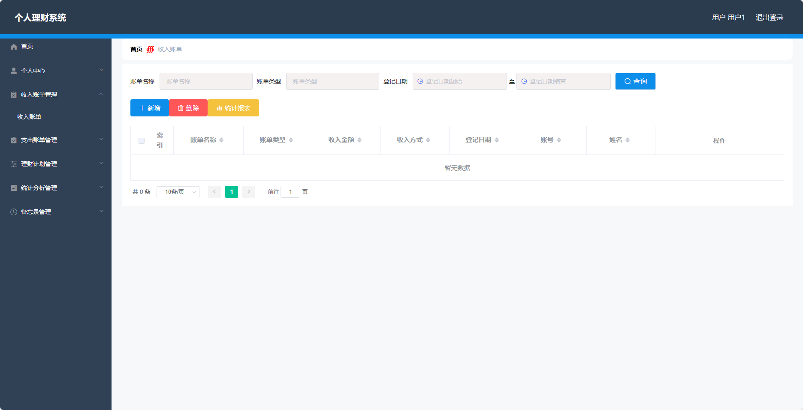
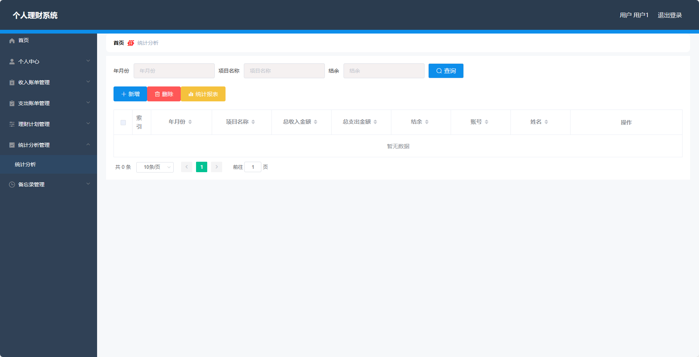

<h1 align="center">基于SpringBoot框架实现的个人理财系统【带文档】</h1>

<h4> 完整代码获取地址：从戎源码网（https://armycodes.com/） </h4>
<h4> 作者微信：19941326836 QQ：605739993 QQ群：655392706 </h4>
<h4> 承接计算机毕设、Java毕业设计、Python毕业设计、深度学习、机器学习 </h4>
<h4> 选题+开题报告+任务书+程序定制+安装调试+论文+答辩ppt 一条龙服务 </h4>
<h4> 毕业设计所有选题地址：(https://github.com/Descartes007/allProject) </h4>

## 项目介绍

基于SpringBoot框架实现的个人理财系统【带文档】：前端 vue、axios、elementui，后端 springboot、mybatis，系统角色分为：管理员和用户，管理员在管理后台用户信息、账单类型等；用户可以查看自己的收支情况、备忘录信息、理财计划等。主要功能如下：

### 管理员

- 个人中心：管理员可以在个人中心查看和修改自己的个人信息。
- 用户管理：管理员可以对用户进行管理，包括添加新用户、编辑用户信息、删除用户以及查看用户列表。
- 账单类型管理：管理员可以管理账单类型，包括添加新的账单类型、编辑账单类型信息、删除账单类型以及查看账单类型列表。

### 用户
- 个人中心：用户可以在个人中心查看和修改自己的个人信息。
- 收入账单管理：用户可以添加和管理收入账单，包括记录收入的金额、时间、来源等信息，查看、编辑和删除已记录的收入账单。
- 支出账单管理：用户可以添加和管理支出账单，包括记录支出的金额、时间、用途等信息，查看、编辑和删除已记录的支出账单。
- 理财计划管理：用户可以制定和管理理财计划，包括设定目标、计划时间、计划金额等信息，查看、编辑和删除已设定的理财计划。
- 统计分析管理：用户可以查看自己的收入和支出情况的统计分析结果。
- 备忘录管理：用户可以添加、编辑和删除备忘录。

## 环境

- <b>IntelliJ IDEA 2020.3</b>

- <b>Mysql 5.7.26</b>

- <b>Maven 3.6.3</b>

- <b>JDK 1.8</b>

## 运行截图

